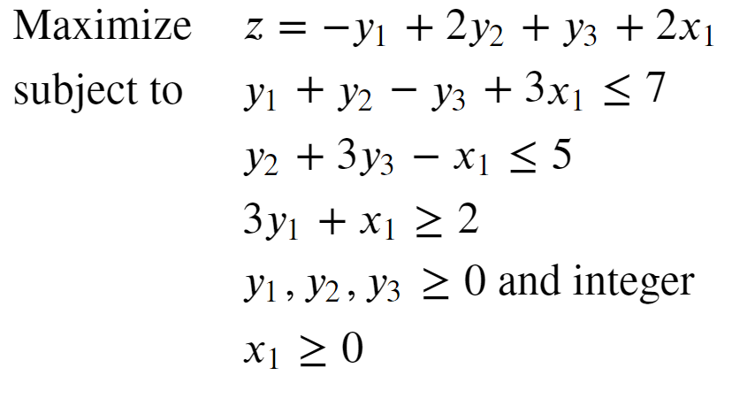
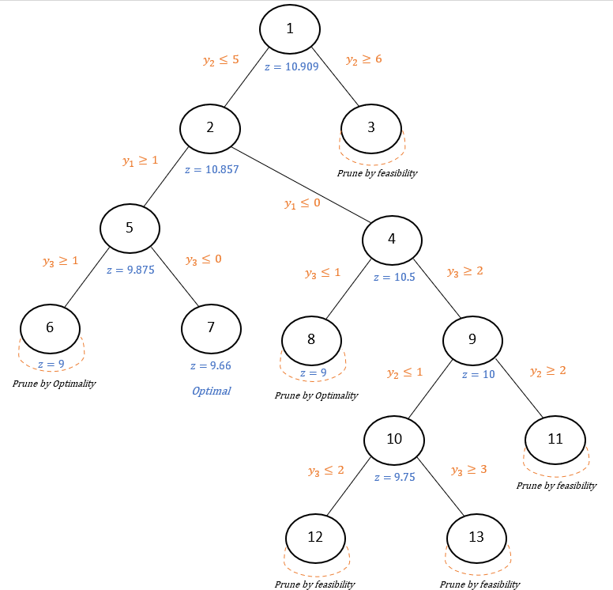

# Project README

## Overview

This project addresses a MILP (Mixed-Integer Linear Programming) optimization problem using a step-by-step approach employing the Branch and Bound algorithm with a BFS (Breadth-First Search) strategy.

The optimization problem is derived from the book Laurence A. Wolsey - Integer programming (2021).

## How it Works

The solution process involves breaking down the MILP optimization problem into smaller subproblems, exploring feasible solutions systematically, and efficiently traversing the solution space using the Branch and Bound method.

## Final Tree

Feel free to reach out for any questions or further clarification.
